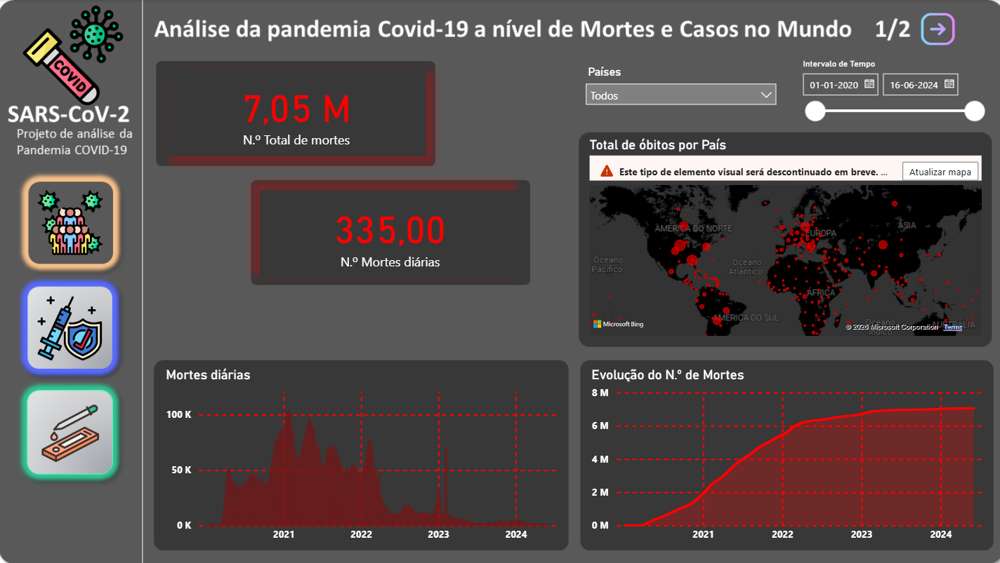
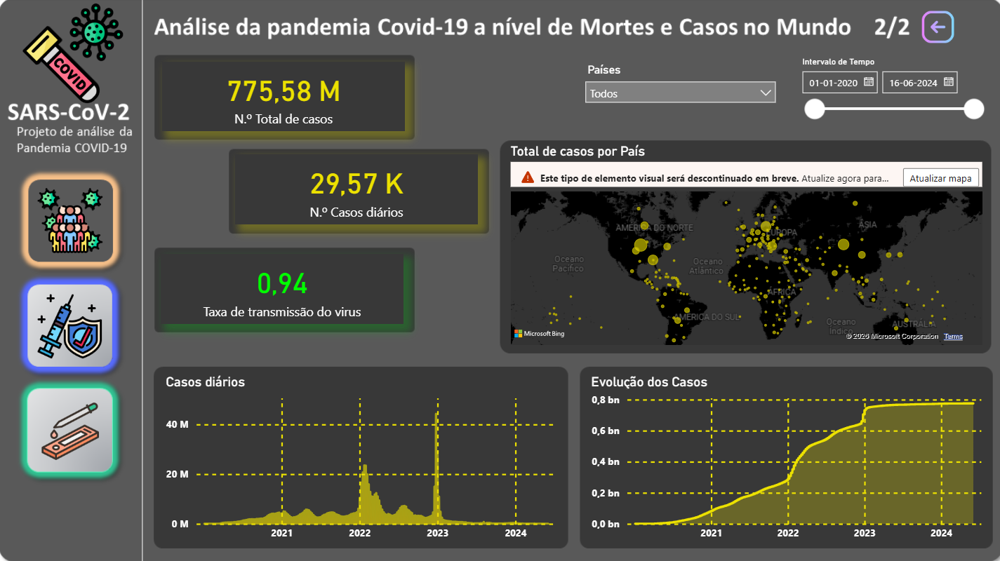
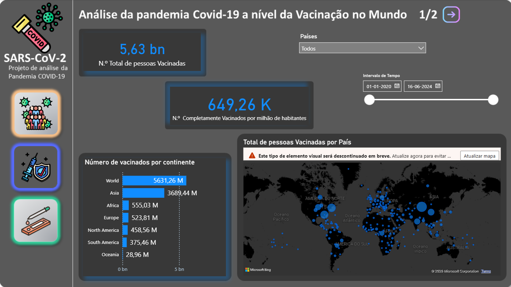
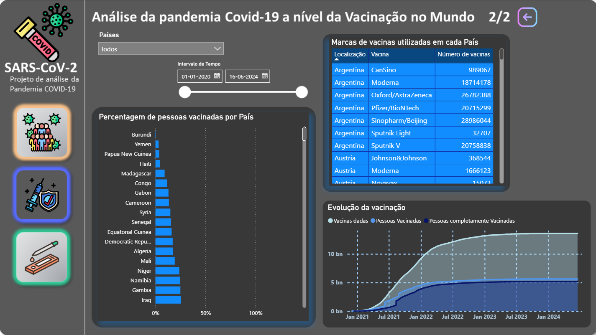
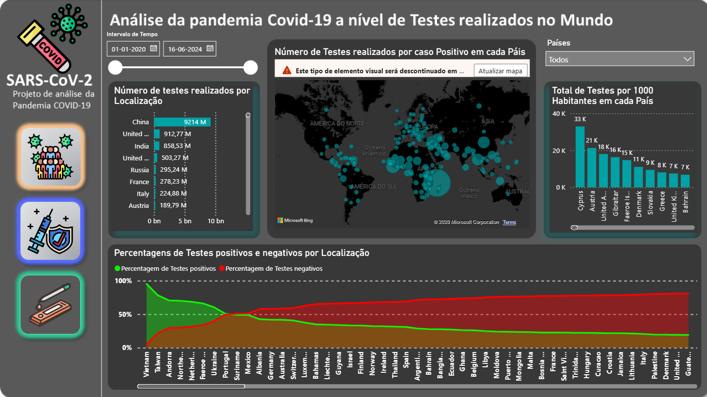
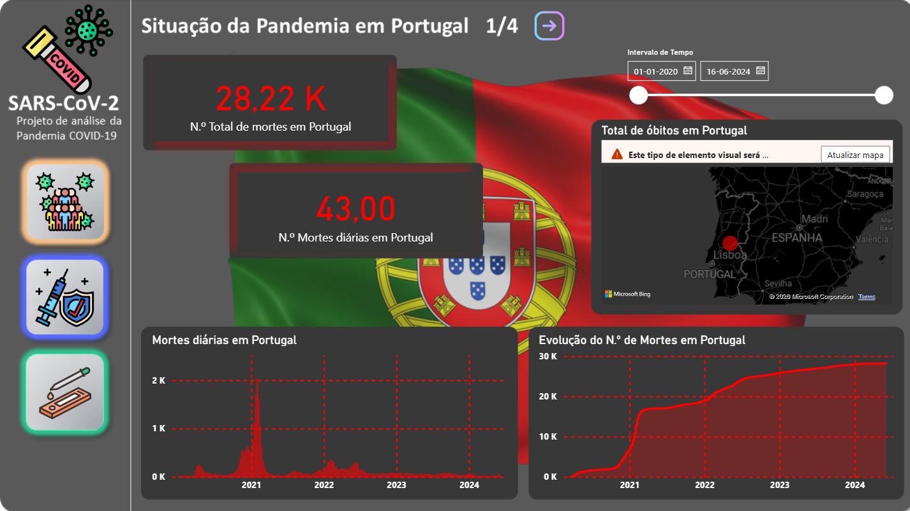
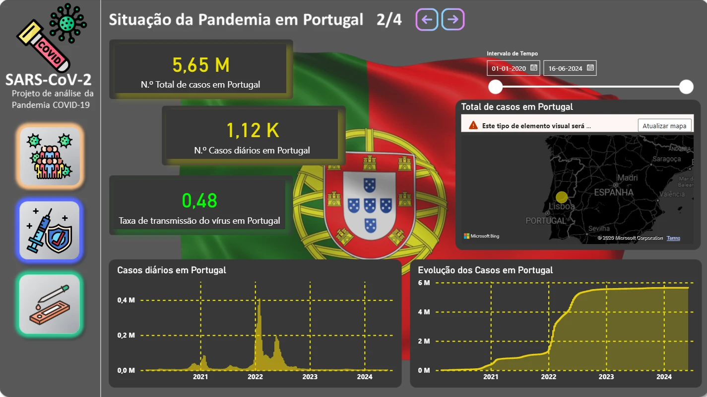
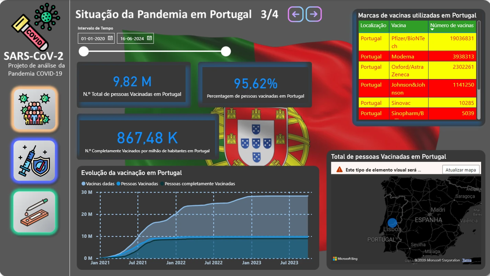
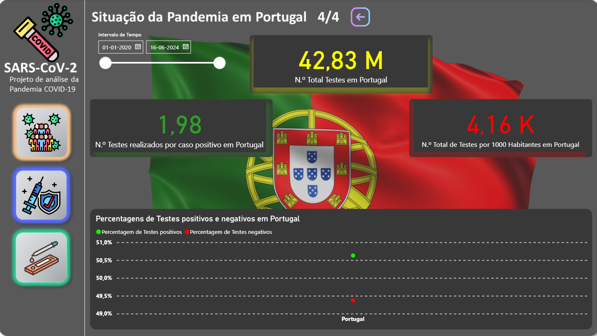

# COVID-19 Pandemic Dashboard

A 10-page Power BI dashboard analyzing the global COVID-19 pandemic from Our World in Data's public dataset, cases, deaths, vaccination and testing worldwide, with a dedicated section for Portugal. Built individually for the Data Science course of my BSc in Computer Engineering at UTAD.

## 📊 What it covers

- **Pandemic**, total and daily cases and deaths worldwide, their evolution over time, and geographic distribution by country.
- **Vaccination**, total people vaccinated, breakdown by continent, percentage vaccinated per country, and which vaccine manufacturers are used where.
- **Testing**, tests performed per country, tests per positive case, and the positive/negative split over time.
- **Portugal**, the same four angles (deaths, cases, vaccination, testing) applied specifically to Portugal, each with its own page.

## 📈 Dashboard pages

### Pandemic

7M+ deaths and 775M+ cases tracked worldwide, each with its own bubble map, daily trend and cumulative evolution.

<p align="center">
  
  
</p>

### Vaccination

5.6bn+ people vaccinated, broken down by continent and plotted by country, plus which vaccine manufacturers were used where and how many doses each delivered.

<p align="center">
  
  
</p>

### Testing

Tests per country, tests per 1000 inhabitants, and how the positive/negative split has shifted over time.

<p align="center">
  
</p>

### Portugal

The same four angles narrowed to a single country, deaths, cases, vaccination and testing, each on its own page.

<p align="center">
  
  
  
  
</p>

## 🗄️ Data model

Built as a star schema in Power Query, the raw Our World in Data export was cleaned and typed, then split so the report could filter by country, continent and date range consistently across all 10 pages. The vaccine manufacturer breakdown comes from a second dataset joined in on country, since it isn't part of the main OWID file.

## 📦 Dataset

[Our World in Data: Coronavirus (COVID-19)](https://ourworldindata.org/coronavirus), the main dataset is not included in this repository since it's over 100MB and updates continuously at the source. `vaccinations-by-manufacturer.csv` is included since it's the smaller, static file used for the manufacturer breakdown. The full `.pbix` already has the data model and visuals built in, only the raw source file needs to be re-pointed to reproduce it from scratch.

## 🛠️ Tech Stack

<p align="center">
  
  
  
  
  
</p>

## 📂 Repository structure

```
Projeto de análise da Pandemia COVID-19.pbix     Power BI report (data model + 10 pages)
vaccinations-by-manufacturer.csv                 vaccine manufacturer dataset
assets/
  dashboard-pandemic-deaths.png
  dashboard-pandemic-cases.png
  dashboard-vaccination-overview.png
  dashboard-vaccination-manufacturers.png
  dashboard-tests.png
  dashboard-portugal-deaths.png
  dashboard-portugal-cases.png
  dashboard-portugal-vaccination.png
  dashboard-portugal-tests.png
```

## 👤 About

Part of my portfolio. See my [GitHub profile](https://github.com/linho22w) for more projects in AI/ML and backend development.
